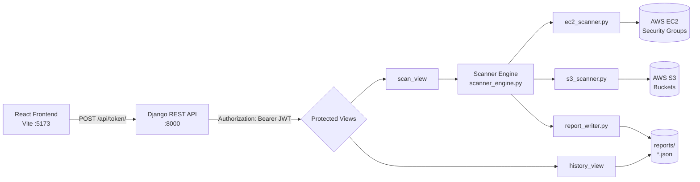
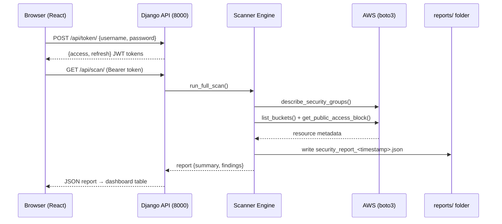
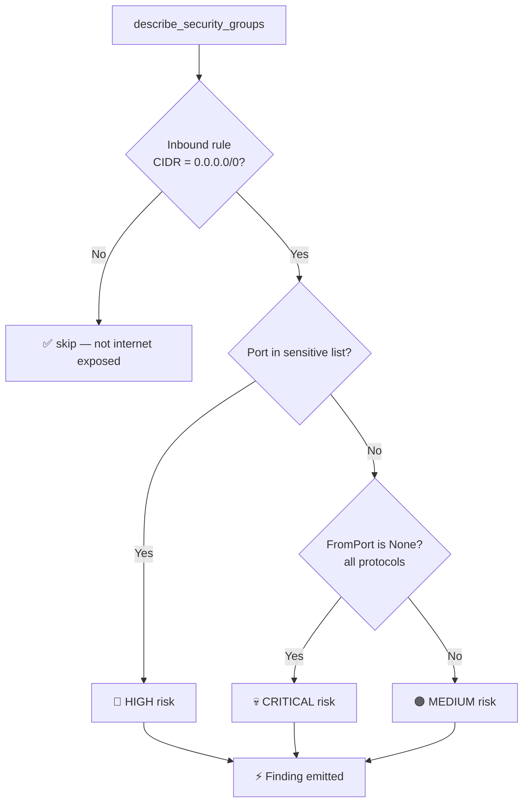

# 🛡️ Cloud Security Automation & Monitoring Platform

> A web-based cloud security platform that scans your AWS account for misconfigurations, classifies risk, and generates timestamped JSON security reports — built with **Django REST Framework** + **React (Vite)** + **boto3**.


-purple)


---

## 📑 Table of Contents

- [🌟 What is this project?](#-what-is-this-project)
- [✨ Features](#-features)
- [🏗️ Architecture](#️-architecture)
- [📁 Project Structure](#-project-structure)
- [⚙️ Prerequisites](#️-prerequisites)
- [🚀 Quick Start (Backend)](#-quick-start-backend)
- [🖥️ Quick Start (Frontend)](#️-quick-start-frontend)
- [🔑 Authentication & API Reference](#-authentication--api-reference)
- [🔍 How the Scanner Works](#-how-the-scanner-works)
- [📊 Report Format](#-report-format)
- [🛤️ Roadmap & Progress](#️-roadmap--progress)
- [🔐 Security Notes](#-security-notes)
- [🤝 Contributing](#-contributing)
- [📄 License](#-license)

---

## 🌟 What is this project?

This platform scans AWS infrastructure for **security misconfigurations** — like SSH (port 22) or databases exposed to the whole internet (`0.0.0.0/0`) — classifies each finding by risk level, and writes a **timestamped JSON report** for audit history. It started as a CLI scanner, grew into a Flask API, and is now evolving into a **multi-user SaaS** with a Django REST backend, JWT authentication, and a React dashboard.

<details>
<summary><b>🎯 Project goal (click to expand)</b></summary>

> *"Mera system AWS se securely baat kar sake aur main cloud security basics samajh jaun."*
> — Build a system that talks to AWS securely and helps you understand cloud security fundamentals.

Target outcome: **Data Collection Layer → Risk Classification Layer → Reporting Layer**, scaling into a real SaaS startup.

</details>

---

## ✨ Features

| Layer | What it does |
|---|---|
| 🔎 **EC2 Scanner** | Reads security groups; flags any inbound rule open to `0.0.0.0/0`, with special attention to sensitive ports |
| 🪣 **S3 Scanner** | Lists all buckets; flags ones with public access blocking disabled or missing |
| 🧠 **Risk Engine** | Classifies every finding as `CRITICAL` / `HIGH` / `MEDIUM` |
| 📝 **Report Writer** | Writes timestamped JSON reports to `reports/` (e.g. `security_report_2026-02-16_00-44-59.json`) |
| 🔐 **Auth** | JWT login via SimpleJWT — scan & history endpoints are protected |
| 🖥️ **React Dashboard** | One-click scan, live summary counters, findings table, and scan history page |

<details>
<summary><b>🧱 Layers of the system</b></summary>

- **Data Collection Layer** — `ec2_scanner.py`, `s3_scanner.py`
- **Risk Classification Layer** — sensitive ports + internet-exposure heuristics
- **Reporting Layer** — `report_writer.py` generates structured, timestamped reports
- **API Layer** — Django REST Framework (`/api/scan/`, `/api/history/`)
- **Frontend Layer** — React + Vite dashboard, history, and login pages

</details>

---

## 🏗️ Architecture



<details>
<summary><b>🔄 Request flow (click for the step-by-step)</b></summary>



</details>

---

## 📁 Project Structure

```text
backend_django/
├── cloudsaas/                  ← Django project root
│   ├── manage.py               ← command runner
│   ├── db.sqlite3
│   ├── cloudsaas/              ← project config package
│   │   ├── settings.py         ← DRF, JWT, CORS config
│   │   ├── urls.py             ← /api/token/, /api/token/refresh/, /api/
│   │   ├── asgi.py
│   │   └── wsgi.py
│   ├── reports/                ← scan reports (DB-adjacent copy)
│   └── scanner/                ← the scanner app
│       ├── views.py            ← scan_view, history_view (JWT protected)
│       ├── urls.py             ← /api/scan/, /api/history/
│       ├── models.py
│       ├── admin.py
│       └── services/
│           ├── scanner_engine.py   ← orchestrates the full scan
│           ├── ec2_scanner.py      ← security-group exposure checks
│           ├── s3_scanner.py       ← public-access-block checks
│           └── report_writer.py    ← JSON report generation
├── frontend/                   ← React + Vite SPA
│   ├── package.json
│   ├── vite.config.js
│   └── src/
│       ├── App.jsx             ← routes: /, /history, /login
│       ├── components/Layout.jsx ← sidebar navigation
│       └── pages/
│           ├── Dashboard.jsx   ← "Start Scan" + summary + findings table
│           ├── History.jsx     ← scan history list
│           └── Login.jsx       ← JWT login
└── reports/                    ← timestamped scan history (root level)
```

<details>
<summary><b>🗺️ Where the root-level files live</b></summary>

The archive also includes:

- `requirements.txt` — backend + frontend install commands
- `tasks.md` — phase-by-phase checklist (account setup → AWS CLI → first scan)
- `notes/roadmap.txt` — the full build diary (Phase A → Phase C)
- `Development_Log.md` / `Flow.md` — architecture & dev journal
- `Flow.docx` — same flow as a Word doc

</details>

---

## ⚙️ Prerequisites

- **Python 3.10+** with `pip` (and `virtualenv` recommended)
- **Node.js + npm** (for the React frontend)
- **Git**
- **AWS account + CLI configured** with a **read-only IAM user**

<details>
<summary><b>🛠️ AWS setup checklist (IAM best practice)</b></summary>

- [ ] Enable a **billing budget alert** (₹0/$0 alert, email on)
- [ ] Create IAM user `cloud-scanner-user` with **Programmatic access**
- [ ] Attach **`ReadOnlyAccess`** policy — *no delete, no modify*
- [ ] Save `Access Key ID` + `Secret Access Key` in a safe note
- [ ] Never commit credentials to GitHub ❌
- [ ] Run `aws configure` (region e.g. `ap-south-1`, output `json`)
- [ ] Smoke-test: `aws iam list-users`

```bash
aws --version
aws configure
aws iam list-users   # should return your users → CLI works 🎉
```

</details>

---

## 🚀 Quick Start (Backend)

```bash
cd backend_django/cloudsaas

# recommended: create & activate a virtual environment
python -m venv venv
source venv/bin/activate        # Windows: venv\Scripts\activate

# install dependencies
pip install django djangorestframework djangorestframework-simplejwt django-cors-headers boto3

# migrate & run
python manage.py migrate
python manage.py runserver      # → http://127.0.0.1:8000
```

> 📌 The services also rely on **boto3** with AWS CLI credentials — configure AWS before scanning.

<details>
<summary><b>🧪 First-run sanity test</b></summary>

```bash
# 1) Server is up
curl http://127.0.0.1:8000/api/scan/    # expect 401 — endpoint is JWT-protected ✅

# 2) Get a token
curl -X POST http://127.0.0.1:8000/api/token/ \
  -H "Content-Type: application/json" \
  -d '{"username": "YOUR_USER", "password": "YOUR_PASS"}'

# 3) Run a scan with the token
curl http://127.0.0.1:8000/api/scan/ \
  -H "Authorization: Bearer <access_token>"
```

Check the `reports/` folder — a new timestamped `security_report_*.json` should appear.

</details>

---

## 🖥️ Quick Start (Frontend)

```bash
cd frontend
npm install
npm run dev     # → http://127.0.0.1:5173
```

> 💡 The React app runs on **5173**, the Django API on **8000**. CORS is already enabled (`CORS_ALLOW_ALL_ORIGINS = True`).

<details>
<summary><b>🧭 Navigating the UI</b></summary>

| Page | Route | What you can do |
|---|---|---|
| Dashboard | `/` | Click **Start Scan** → see live summary + findings table |
| History | `/history` | Browse past scans (timestamp + high-risk count) |
| Login | `/login` | JWT login — token is stored in `localStorage` and sent as `Authorization: Bearer` |

</details>

---

## 🔑 Authentication & API Reference

All scan endpoints require a JWT. Login once, store the `access` token, send it on every request.

| Method | Endpoint | Auth | Description |
|---|---|---|---|
| `POST` | `/api/token/` | ❌ none | Get `{access, refresh}` token pair |
| `POST` | `/api/token/refresh/` | ❌ none | Refresh an expired access token |
| `GET` | `/api/scan/` | ✅ Bearer | Run a full AWS scan, return + save report |
| `GET` | `/api/history/` | ✅ Bearer | List all past scans (file, timestamp, summary) |

<details>
<summary><b>📦 Example request / response</b></summary>

**Login**
```bash
curl -X POST http://127.0.0.1:8000/api/token/ \
  -H "Content-Type: application/json" \
  -d '{"username": "user", "password": "pass"}'
```

**Scan**
```json
GET /api/scan/
Authorization: Bearer <access_token>
```

```json
{
  "timestamp": "2026-02-16 00:44:59",
  "summary": { "total_findings": 1, "high": 1, "medium": 0, "critical": 0 },
  "findings": [
    {
      "service": "EC2",
      "resource": "mini-project-sg",
      "port": 22,
      "protocol": "tcp",
      "cidr": "0.0.0.0/0",
      "risk": "HIGH"
    }
  ]
}
```

</details>

---

## 🔍 How the Scanner Works

### EC2 — Security Group Exposure



**Sensitive ports** monitored: `22` (SSH) · `3389` (RDP) · `3306` (MySQL) · `5432` (PostgreSQL) · `27017` (MongoDB)

### S3 — Public Access Block

- Every bucket's `get_public_access_block()` config is checked.
- If any block is **disabled** → `HIGH` — *"Public access block disabled"*
- If the bucket **has no config at all** → `HIGH` — *"No public access block configuration"*

### Report Writer

- Builds `{timestamp, summary, findings}`.
- Saves to the root `reports/` folder as `security_report_<YYYY-MM-DD_HH-MM-SS>.json`.
- Returns the report object to the API caller.

<details>
<summary><b>🧠 Risk classification logic</b></summary>

| Condition | Risk |
|---|---|
| Port is `None` (all ports) + open to `0.0.0.0/0` | `CRITICAL` |
| Sensitive port (22/3389/3306/5432/27017) + open to world | `HIGH` |
| Any other port open to `0.0.0.0/0` | `MEDIUM` |
| S3 public access block disabled or missing | `HIGH` |

</details>

---

## 📊 Report Format

Every scan produces a JSON file like this (from an actual run):

```json
{
    "timestamp": "2026-02-16 00:44:59",
    "summary": {
        "total_findings": 1,
        "high": 1,
        "medium": 0,
        "critical": 0
    },
    "findings": [
        {
            "service": "EC2",
            "resource": "mini-project-sg",
            "port": 22,
            "protocol": "tcp",
            "cidr": "0.0.0.0/0",
            "risk": "HIGH"
        }
    ]
}
```

---

## 🛤️ Roadmap & Progress

> Status tracked in `tasks.md` and `notes/roadmap.txt`.

### ✅ Phase 0 — Account & Local Setup
- [x] GitHub / AWS / Vercel-Netlify accounts
- [x] Python 3.10+ · pip + venv · Node.js + npm · Git
- [x] AWS CLI configured + boto3 test (S3 buckets listing)

### ✅ Phase A — Foundation
- [x] Budget alerts & IAM read-only user (`cloud-scanner-user`)
- [x] EC2 security-group scanner (started as `test_security_groups.py`)
- [x] Generic internet-exposure detector + risk classification
- [x] Structured JSON reports (`security_scanner.py` → `report_writer.py`)
- [x] S3 public-bucket detection (`s3_scanner.py`)
- [x] Clean architecture: `scanners/` + `core/` + `main.py`

### ✅ Phase B — API & Frontend
- [x] Flask API (`/scan` endpoint)
- [x] Timestamped reports + scan history (`/history`, `/report/<filename>`)
- [x] React + Vite frontend, multi-page routing, dashboard + history

### 🔄 Phase C — Django SaaS (in progress)
- [x] Django project `cloudsaas` + `scanner` app
- [x] DRF + SimpleJWT + CORS headers wired in `settings.py`
- [x] Protected `/api/scan/` & `/api/history/` endpoints
- [x] React login → JWT stored in localStorage → bearer-authenticated scans
- [ ] Per-user scan history stored in the DB (currently file-based)

<details>
<summary><b>🚀 Next big milestones</b></summary>

- [ ] **DB-backed scan history** — per-user records instead of folder listing
- [ ] Registration endpoint + user signup flow
- [ ] Detailed single-report view (`/report/:id`)
- [ ] Auto-scan scheduling (workflows / cron)
- [ ] Deployment: backend + frontend to production

</details>

---

## 🔐 Security Notes

- **Read-only IAM**: the scanner only *reads* AWS state — no delete, no modify. Safe & professional.
- **JWT protected**: `/api/scan/` and `/api/history/` reject unauthenticated requests.
- **Never commit AWS keys** — use environment variables or the AWS CLI credential chain; add keys to `.gitignore`.
- ⚠️ `DEBUG = True` and `SECRET_KEY` are dev defaults — **change both before any production deployment**.
- ⚠️ `CORS_ALLOW_ALL_ORIGINS = True` — tighten this to your frontend origin in production.

---

## 🤝 Contributing

1. Fork the repo
2. Create a feature branch (`git checkout -b feature/amazing-scanner`)
3. Commit your changes (`git commit -m 'Add amazing scanner'`)
4. Push to the branch (`git push origin feature/amazing-scanner`)
5. Open a Pull Request 🚀

---

## 📄 License

This project is for learning and personal development. No explicit license is included — reach out to the maintainer before reusing commercially.

---

<p align="center">
  Made with 💜 · Cloud Security Automation & Monitoring Platform · Phase C — SaaS mode activating 🛡️
</p>
